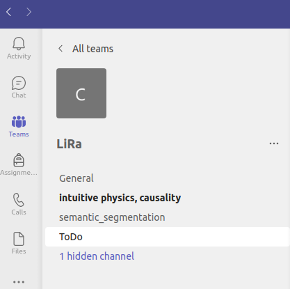
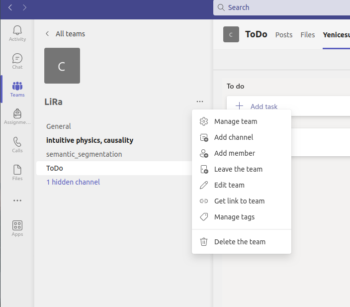

# Microsoft Teams Tutorial and Documentation
This documentation is designed to help with Teams' functionalities and decide on the style that will be used on the LiRA lab's Teams channel.
## Creating a Channel
To add a new channel to the designated Teams, first hover over the three dots next to the LiRA in the Teams section.
 \n
After clicking on the three dots, select the "Add channel" option from the context menu.

