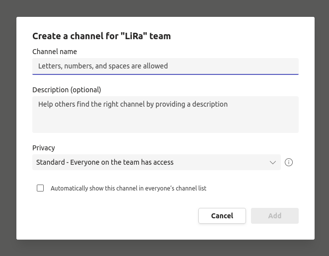

# Microsoft Teams Tutorial and Documentation
This documentation is designed to help with Teams' functionalities and decide on the style that will be used on the LiRA lab's Teams channel.
## Creating a Channel
To add a new channel to the designated Teams, first hover over the three dots next to the LiRA in the Teams section. 
  
After clicking on the three dots, select the "Add channel" option from the context menu. 
  
Then decide on the channel's name and provide a brief description of the channel's purpose. Please be clear about the channel's name and follow the Snake case naming convention where all letters should be lowercase and "_" should be used instead of space. If you intend to make this channel public (Standard), please check the box next to "Automatically show this channel in everyone’s channel list". 
  
### Opt: Creating a Private & Shared Channel
If you decide to open a private or shared channel, please follow the exact steps described above but change the "Privacy" from the dropdown menu to the desired option. Take notice that some integrated apps are not working for channels other than the standard.  
#### Channel Types
Standard: A standard channel is the default type of a channel. You can’t manage members at the channel level but it has advanced features that are not available in the other two types. 
Private: This type of a channel lets you create a secure collaboration space for a subgroup of people who are already members of the team. 
Shared: This type of channel lets you create a secure collaboration space for team members and non-members. Most importantly, you can share one channel between multiple teams. 
