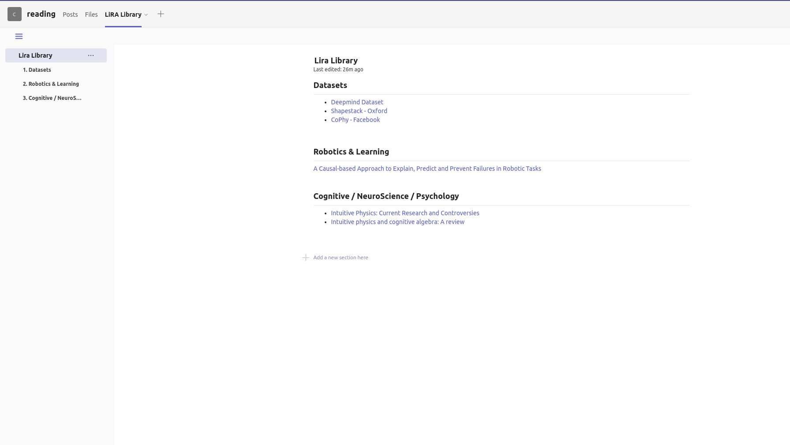

- [Microsoft Teams Tutorial and Documentation](#microsoft-teams-tutorial-and-documentation)
  * [Creating a Channel](#creating-a-channel)
    + [Channel Types](#channel-types)
    + [Opt: Creating a Private & Shared Channel](#opt--creating-a-private---shared-channel)
  * [Calendar & To Do](#calendar---to-do)
    + [Calendar](#calendar)
      - [Opt: Multi-User Events](#opt--multi-user-events)
    + [To Do](#to-do)
      - [Add Task](#add-task)
      - [Assigned Tasks](#assigned-tasks)
  * [Reading](#reading)
    + [Posts](#posts)
    + [LiRA Library](#lira-library)
    
# Microsoft Teams Tutorial and Documentation
This documentation is designed to help with Teams' functionalities and decide on the style that will be used on the LiRA lab's Teams channel.
## Creating a Channel
To add a new channel to the designated Teams, first hover over the three dots next to the LiRA in the Teams section. 
  
After clicking on the three dots, select the "Add channel" option from the context menu. 
  
Then decide on the channel's name and provide a brief description of the channel's purpose. Please be clear about the channel's name and follow the snake case naming convention where all letters should be lowercase and "_" should be used instead of space like "naming_convention". If you intend to make this channel public (Standard), please check the box next to "Automatically show this channel in everyone’s channel list". 
  
### Channel Types
Standard: A standard channel is the default type of a channel. You can’t manage members at the channel level but it has advanced features that are not available in the other two types. 
Private: This type of a channel lets you create a secure co havent llaboration space for a subgroup of people who are already members of the team. 
Shared: This type of channel lets you create a secure collaboration space for team members and non-members. Most importantly, you can share one channel between multiple teams. 
### Opt: Creating a Private & Shared Channel
If you decide to open a private or shared channel, please follow the exact steps described above but change the "Privacy" from the dropdown menu to the desired option. Take notice that some integrated apps are not working for channels other than the standard.  
## Calendar & To Do
A lab calendar and to-do are available at the "calendar_and_todos" channel.
### Calendar
We are using a calendar to notify others about our lecture hours and other types of unavailabilities during office hours. To access the calendar, first, you should share the Gmail that you use for your calendars with Arda Sarp Yenicesu (preferably through Teams or email: sarp.yenicesu@bilkent.edu.tr). After you are notified of the access, you can start to add your events and view others through the Calendar tab.  
  
To add a new event to the calendar, please hover over the create button at the top left of the page and select "Event". First, decide the timeline of your event, and please make sure that you select the LiRA Calendar at the bottom of the pop-up menu. You should follow the naming convention when you create a new event. The event should start with your initials, followed by "-" and be finalized with a one-word description of it without any space like "ASY-DEMO".  
  
#### Opt: Multi-User Events
You can also add an event with multiple users. If you decide to do so, you should add them with their Gmail as guests while creating the event to notify them and add "+" after your initials while naming the event such as "ASY+-DEMO".  
### To Do
We are using a to-do app to assign lab/research-related tasks to ourselves and our collaborators. First, you should hover over the three dots at the vertical navigation bar, find the "Tasks by Planner and To Do" app, and pin it.  
  
#### Add Task
In the "calendar_and_todos" channel, there is a tab called "LiRA To Do". You can assign a new task to yourself and others from that tab by clicking on "Add task". Task names should be precise and clear to prevent conflicts with other tasks. You can also select a due date or assign a person to the task. Please be reasonable about the due date and refrain from assigning a task to others if you haven't contacted them.  
  
#### Assigned Tasks
To check the assigned tasks, go to "Tasks by Planner and To Do" that you have pinned. In this app, you can see all of the tasks in the "Shared plans" section and tasks that are assigned to you in the "My tasks" section.  
  
## Reading
We are using the "reading" channel to share papers and discuss them with others that are related to our/others' research or the ones we have found interesting.
### Posts
If you want to share a document, you need to start a new conversation at the "Posts" tab and select the "format" option to follow the sharing format. 
  
The subject should be the title of the article, and it should be shared with the article's abstract and its authors as follows: 
  
To format the abstract easily you can use the following web-tool: https://lingojam.com/TexttoOneLine
### LiRA Library
LiRA Library is a wiki where we store all of the shared papers, repositories, and datasets with their URLs. If the document that you have shared has an URL, then you should also update the wiki accordingly. To update the wiki, select an appropriate category for your document; if you feel like there is no suitable heading for the document, then you can create one by clicking the "+" as follows: 
  
If there is one, then you can add your document as a hyperlink to the desired section with its title and access URL in a new line by pressing "enter" after the latest entry in that section.

## Sign in/up to Teams for Undergraduates
1.	Go to Microsoft Teams’ main page (https://www.microsoft.com/en-us/microsoft-teams/log-in).

2.	Click on “Sign up” button (located on the top right corner) if you do not have an account already. If you have an account, skip to the step 3. 
    -	Using one of your personal e-mail addresses, fill the textbox and click on “Next” button.
    -	Select the “For work and organizations” option and click on “Next” button.
    -	The following pop-up should appear. Click on “Send code” button. You can set a password if you desire to do so by clicking on “Use your password instead” link.
    -	Using the code sent to your given e-mail address, fill the textbox and click on “Sign in” button. 
    -	You may stay signed in if you want. Click on “Yes” if you decided to do so. Otherwise click on “No” button. 
    -	Fill the required information for your identification/contact name and click on “Next” button. 
    -	You should be all set. Skip to step 4. 

3.	If you have a valid account for Microsoft Teams, click on “Sign in” button (located on the top right corner).
    -	Using your personal e-mail address that was used to create your account, fill the textbox and click on “Next” button.
    -	Select the “For work and organizations” option and click on “Next” button.
    -	The following pop-up should appear. Click on “Send code” button. You can set a password if you desire to do so by clicking on “Use your password instead” link.
    -	Using the code sent to your given e-mail address, fill the textbox and click on “Sign in” button. 
    -	You may stay signed in if you want. Click on “Yes” if you decided to do so. Otherwise click on “No” button.

4.	Contact with your TA to invite you to your Team. 
    -	After they invite you, there should be a mail sent to your e-mail address for Microsoft Teams. 
    -	Click on “Open Microsoft Teams” link that is sent with the invitation mail. This link will open Microsoft Teams.
    -	If you do not see your Team on the “Teams” tab of your account, click on your profile photo located on the top left corner and then click on “Sign out” button.
    -	Sign in again using step 3.
    -	It should ask you which organization you want to sign into. From the dropdown menu, select İhsan Dogramaci Bilkent University (Guest).

5.	You are all set!

